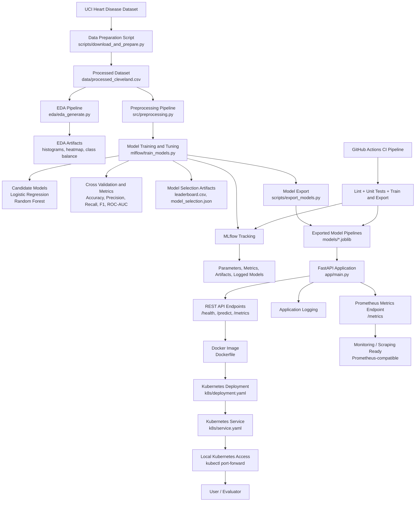

# Architecture Diagram

The following Mermaid diagram represents the end-to-end MLOps architecture used in this project.

## Components Covered

This architecture includes the assignment-required components:

- dataset
- preprocessing and training
- MLflow
- model export
- FastAPI
- Docker
- Kubernetes
- monitoring

## How to Use It in the Report

You can:

1. copy the Mermaid block directly into your markdown report if the renderer supports Mermaid
2. render it using a Mermaid editor and save it as an image
3. place the rendered image in `screenshots/12_architecture_diagram.png`

If you want a rendered version, you can paste the Mermaid code into:

- https://mermaid.live/

and export it as PNG or SVG for the final report.
