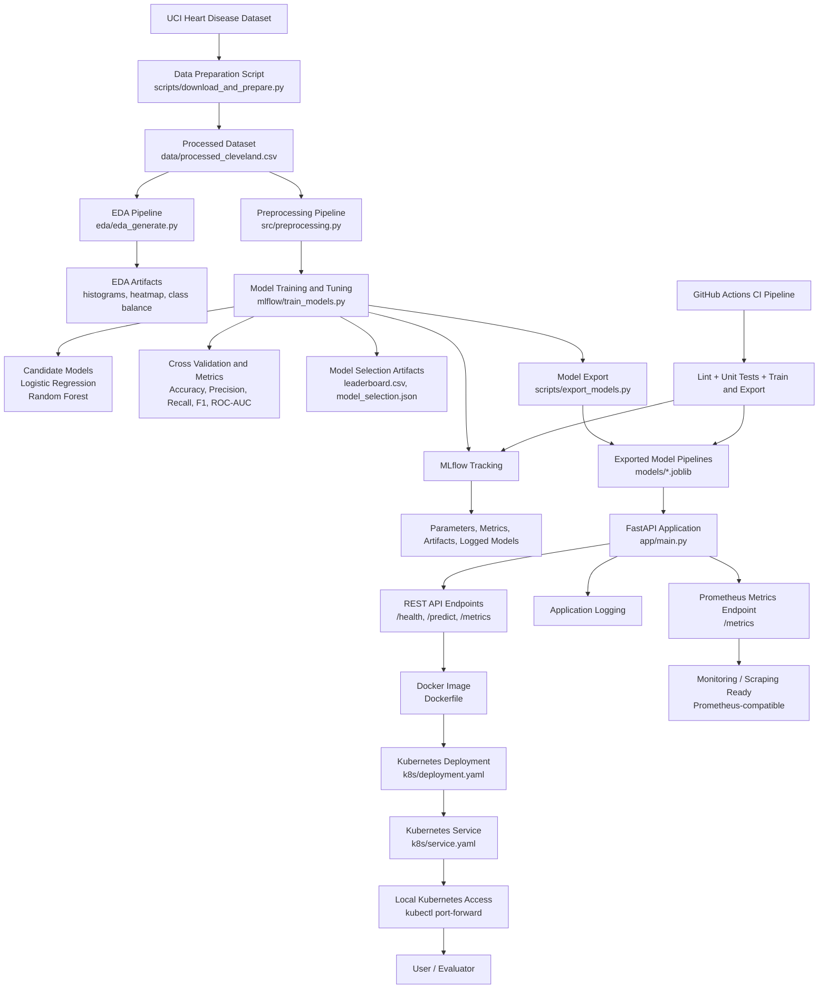

# Heart Disease MLOps — End-to-End Reference

A reference document explaining the project end to end. Each section describes what a component
is, why it exists, and the exact command that runs it — kept in the order the pipeline flows so
it can be followed top to bottom.

## 0. Architecture Overview

**Problem statement:** predict the risk of heart disease from patient health data and serve the
model as a monitored, cloud-ready API.

The diagram below is the overall map of the solution — how raw data becomes a deployed,
monitored prediction service.



Reading the flow: raw data passes through preparation and EDA into a preprocessing + training
pipeline with two tuned models, all tracked in MLflow. The selected model is exported, wrapped
in a FastAPI service, containerized with Docker, and deployed to both Kubernetes and Render,
with application logging and a Prometheus-ready metrics endpoint. GitHub Actions CI lints,
tests, trains, and exports on every push.

---

## 1. Prerequisites

The tools required to run every part of the project:

- Git
- Python 3.9+
- Docker Desktop (with **Kubernetes enabled**: Settings ? Kubernetes ? Enable Kubernetes)
- A Docker Hub account (image namespace used here: `nikhil04`)
- A Render account connected to your GitHub

Quick sanity check:

```bash
git --version
python3 --version
docker --version
kubectl version --client
```

---

## 2. Create a working directory and clone the repo

```bash
mkdir -p ~/demo && cd ~/demo
git clone <YOUR_GITHUB_REPO_URL> heart-disease-mlops
cd heart-disease-mlops
```

Starting from an empty directory and a clean clone demonstrates that the project is fully
reproducible — nothing depends on files that only exist on the local machine.

---

## 3. Create a virtual environment and install requirements

```bash
python3 -m venv .venv
source .venv/bin/activate
python3 -m pip install --upgrade pip
python3 -m pip install -r requirements.txt
```

An isolated virtual environment pins the exact dependency versions, so the same code produces
the same results on any machine — a core MLOps reproducibility requirement.

---

## 4. The reproducible pipeline

A single command runs the whole training flow in a fixed order — data prep ? EDA ?
training/tracking ? model export — and fails fast if any step errors.

```bash
python3 scripts/run_reproducible_pipeline.py
```

What it produces:

- `data/processed_cleveland.csv` — cleaned dataset
- `artifacts/eda/` — histograms, correlation heatmap, class balance
- `mlruns/` + `artifacts/models/` — tracked runs, leaderboard, ROC/confusion plots
- `models/*.joblib` + `models/model_metadata.json` — serialized model pipelines

The generated outputs can be inspected directly:

```bash
ls artifacts/eda/
cat artifacts/models/leaderboard.csv
ls models/
```

Two models — Logistic Regression and Random Forest — are tuned with `GridSearchCV` and compared
with cross-validation on accuracy, precision, recall, F1, and ROC-AUC. The best pipeline, with
preprocessing bundled together with the classifier, is exported as the serving artifact.

---

## 5. Experiment tracking with the MLflow UI

```bash
export MLFLOW_TRACKING_URI=sqlite:///mlflow.db
mlflow ui
# http://127.0.0.1:5000
```

The MLflow UI lists every training run and lets runs be compared side by side. Each run records
its **parameters** (hyperparameters, chosen model), **metrics** (accuracy, precision, recall,
F1, ROC-AUC), and **artifacts** (ROC curve, confusion matrix, the logged model). This is what
makes results auditable and reproducible over time. The UI stops with `Ctrl+C`.

---

## 6. Containerizing the serving API

The production Dockerfile installs `requirements-prod.txt`, copies `models/` and `app/`, and
serves the FastAPI app on port 8000:

```bash
docker build -t nikhil04/heart-disease-api:v3 .
```

Running the image locally with the port mapped:

```bash
docker run -d --name heart-api -p 8000:8000 nikhil04/heart-disease-api:v3
```

The health endpoint confirms the container is serving:

```bash
curl http://localhost:8000/health
```

The `/predict` endpoint takes JSON in and returns a prediction plus confidence:

```bash
curl -X POST http://localhost:8000/predict \
  -H "Content-Type: application/json" \
  -d '{
    "instances": [
      {"age": 67, "sex": 1, "cp": 4, "trestbps": 160, "chol": 286, "fbs": 0,
       "restecg": 2, "thalach": 108, "exang": 1, "oldpeak": 1.5, "slope": 2,
       "ca": 3, "thal": 3}
    ]
  }'
```

Expected response shape:

```json
{"predictions": [1], "probabilities": [0.87]}
```

The API also exposes interactive docs and a metrics endpoint:

- Swagger UI: http://localhost:8000/docs
- Prometheus metrics: http://localhost:8000/metrics

The model is now packaged in a self-contained image that builds and serves predictions with
confidence scores independently of the host environment — the container is proof it runs
anywhere, not just on the development machine.

---

## 7. The image in Docker Desktop

In **Docker Desktop ? Images**, the built image appears as `nikhil04/heart-disease-api:v3`.
Under **Containers**, the running `heart-api` container and its logs are visible — the request
logging emitted by the API shows up here.

The local container can be removed once no longer needed:

```bash
docker stop heart-api && docker rm heart-api
```

---

## 8. Push the image to Docker Hub

```bash
docker login
docker push nikhil04/heart-disease-api:v3
```

The pushed tag then appears in the repository on https://hub.docker.com. Publishing to a public
registry means any cluster — local or cloud — can pull and run the exact same image.

---

## 9. Kubernetes deployment (Docker Desktop)

The active context should point at the Docker Desktop cluster:

```bash
kubectl config use-context docker-desktop
kubectl get nodes
```

Applying the manifests creates the Deployment (with liveness/readiness probes) and the Service:

```bash
kubectl apply -f k8s/deployment.yaml
kubectl apply -f k8s/service.yaml
```

The pod status can be watched until it is `Running` and `READY 1/1`:

```bash
kubectl get pods -w
# Ctrl+C once the pod is Running and READY 1/1
kubectl get svc heart-disease-api-service
```

The Service is `NodePort`, so a port-forward gives a clean local URL:

```bash
kubectl port-forward svc/heart-disease-api-service 8080:80
```

From a second terminal, the deployed endpoint responds:

```bash
curl http://localhost:8080/health

curl -X POST http://localhost:8080/predict \
  -H "Content-Type: application/json" \
  -d '{"instances": [{"age": 67, "sex": 1, "cp": 4, "trestbps": 160, "chol": 286, "fbs": 0, "restecg": 2, "thalach": 108, "exang": 1, "oldpeak": 1.5, "slope": 2, "ca": 3, "thal": 3}]}'
```

The pod logs show the API's request logging, which doubles as monitoring evidence:

```bash
kubectl logs deploy/heart-disease-api
```

The same public image runs on Kubernetes with liveness/readiness health probes and a Service.
The Service is `NodePort`, exposed locally via port-forward because this is a single-node
cluster; on a cloud provider this would instead be a LoadBalancer or Ingress.

Useful evidence to capture: `kubectl get pods`, `kubectl get svc`, and a successful `/predict`
response.

The deployment can be removed afterwards:

```bash
kubectl delete -f k8s/service.yaml -f k8s/deployment.yaml
```

---

## 10. Deploy on Render (public cloud)

Render reads `render.yaml`, which declares **two** services:

- `heart-disease-api` (FastAPI, from `Dockerfile`)
- `heart-disease-streamlit` (Streamlit UI, from `Dockerfile.streamlit`)

A push to `main` triggers the deployment:

```bash
git push origin main
```

In the Render dashboard:

1. **New ? Blueprint** points at this repository.
2. Render reads `render.yaml` and provisions both services; the build/deploy logs stream live.
3. Once the API service is live, its public URL becomes available.
4. On the **Streamlit service ? Environment**, `HEART_DISEASE_API_URL` is set to the API's
   public URL (if not auto-filled), and the service redeploys.

The public API responds directly:

```bash
curl https://<your-api-service>.onrender.com/health
```

The **Streamlit app URL** provides a UI where sample patient values are entered and submitted,
and the prediction with its confidence is rendered from the live API. This is the full
UI ? API ? model round trip running on public cloud infrastructure.

Evidence to capture: the Render dashboard with both services live, the deploy logs, the live
Streamlit prediction, and the API `/docs` page.

---

## 11. Summary

The end-to-end flow, in one line:

Clean clone ? venv ? reproducible pipeline (data, EDA, training, MLflow tracking, model
export) ? Docker image ? Docker Hub ? Kubernetes deployment ? Render cloud deployment with a
Streamlit front-end.

Together these cover the full MLOps lifecycle: reproducible training, experiment tracking,
containerization, CI/CD, and a monitored, cloud-deployed API.

---

## Quick command index

| Stage | Command |
|-------|---------|
| Clone | `git clone <REPO_URL> && cd heart-disease-mlops` |
| Env | `python3 -m venv .venv && source .venv/bin/activate && pip install -r requirements.txt` |
| Pipeline | `python3 scripts/run_reproducible_pipeline.py` |
| MLflow | `export MLFLOW_TRACKING_URI=sqlite:///mlflow.db && mlflow ui` |
| Build | `docker build -t nikhil04/heart-disease-api:v3 .` |
| Run | `docker run -d --name heart-api -p 8000:8000 nikhil04/heart-disease-api:v3` |
| Push | `docker login && docker push nikhil04/heart-disease-api:v3` |
| K8s deploy | `kubectl apply -f k8s/deployment.yaml -f k8s/service.yaml` |
| K8s access | `kubectl port-forward svc/heart-disease-api-service 8080:80` |
| Render | `git push origin main` ? New Blueprint in dashboard |
